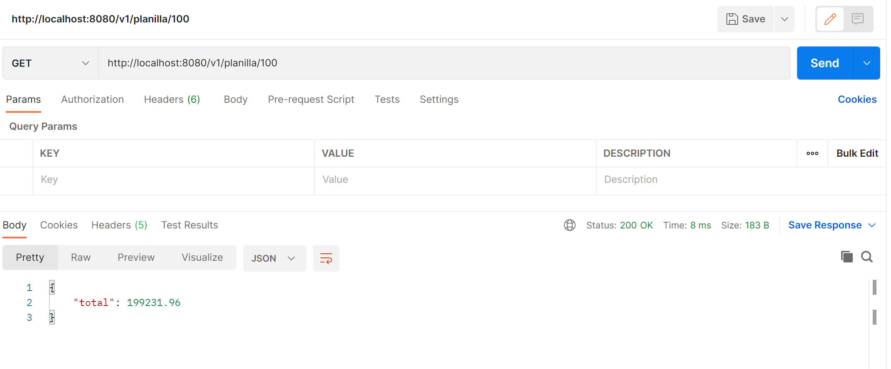

# Repositorio PGD Planillas

Este repositorio contiene una aplicación desarrollada en Spring Boot 3 y Java 17 para gestionar planillas. Puedes seguir las instrucciones a continuación para ejecutar la aplicación localmente.

## Requisitos Previos

Asegúrate de tener instalado lo siguiente en tu sistema:

- [Docker](https://docs.docker.com/get-docker/)

**Alternativamente:**

- [Java 17](https://www.oracle.com/java/technologies/javase-jdk17-downloads.html)
- [Gradle](https://gradle.org/) (Solo si no se ha empaquetado la aplicación como JAR)

## Ejecutar con Docker

1. Clona el repositorio a tu máquina local.

```bash
git clone https://github.com/CristhianArce/planillas.git
```
2. Corre el siguiente comando desde la raíz del proyecto.
```bash
./gradlew build
```
3. Construye la imagen Docker.
```bash
docker build -t pgd-planillas .
```
4. Ejecuta el contenedor (Asegurate de tener el puerto 8081 libre).
```bash
docker run -p 8081:8080 pgd-planillas:latest
```

4. La aplicación estará disponible en http://localhost:8081/v1/planilla/{id}
5. Ahora debería poder probar el endpoint y obtener una respuesta similar a la siguiente:


## Ejecutar sin Docker

Una vez que haya descargado el JDK 17, asegurese de agregar esta nueva versión de java como variable de entorno.

1. Clona el repositorio a tu máquina local.

```bash
git clone https://github.com/CristhianArce/planillas.git
```
 
2. Construye el proyecto con Gradle (solo si no se ha empaquetado la aplicación como JAR).
Ahora, en la raíz del proyecto ejecute el siguiente comando:
```bash
./gradlew build
```
3. Ejecute la aplicación desde la raíz del proyecto
```bash
./gradlew bootRun
```

La aplicación estará disponible en http://localhost:8080.

Recuerda que, en el caso de ejecutar sin Docker, es necesario tener instalado Java 17